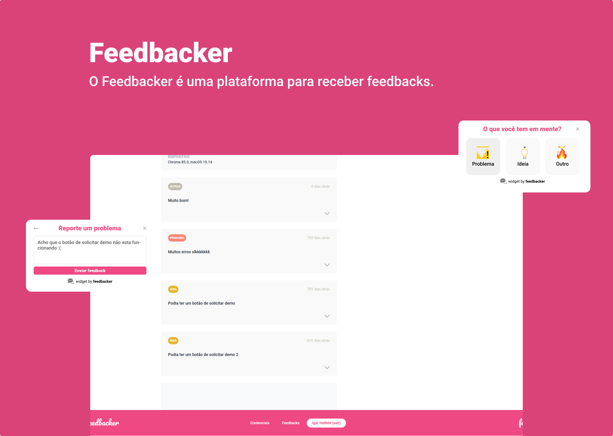

# Feedbacker

## 📄 Overview

Feedbacker is a platform to receive feedbacks from sites through a widget and show them on your own dashboard.

## 🏭 Technologies

### Vue.js

Vue is a JavaScript framework for building user interfaces using HTML, CSS, and JavaScript (Source: Vue.js)

[Official website](https://vuejs.org/)

### TailwindCSS

A utility-first CSS framework packed with classes that can be composed to build any design, directly in your markup. (Source: TailwindCSS)

[Official website](https://tailwindcss.com/)

### Docker

Docker enables you to separate your applications from your infrastructure so you can deliver software quickly. (Source: Docker)

[Official website](https://docker.com)

## 🧪 Additional Tools

### ESLint

ESLint is a tool for identifying and reporting on patterns found in ECMAScript/JavaScript code. (Source: ESLint)

[Official website](https://eslint.org/)

### Jest

Jest is a delightful JavaScript Testing Framework with a focus on simplicity. (Source: Jest)

[Official website](https://jestjs.io/)

### Cypress

Cypress is a purely JavaScript-based front-end testing tool built for the modern web. (Source: BrowserStack)

[Official website](https://www.cypress.io/)

## 💻 Usage

You can run this project in you local machine by following the [Installation](#construction_worker-installation) guide.

## :construction_worker: Installation

- Run Back-end
```bash
# Access back-end's folder
$ cd dashboard
# Install dependencies
$ npm
# Run docker container
$ npm run container
```

You can access the Back-end API from [`localhost:3000`](http://localhost:3000) url.

- Run Dashboard

```bash
# Access dashboard's folder
$ cd dashboard
# Install dependencies
$ npm
# Run project
$ npm run serve
```

You can access Dashboard [`localhost:8080`](http://localhost:8080) from your browser.

- Run Widget

```bash
# Access widget's folder
$ cd widget
# Install dependencies
$ npm
# Run project
$ npm run serve
```

You can access Widget [`localhost:8080`](http://localhost:8080) from your browser.